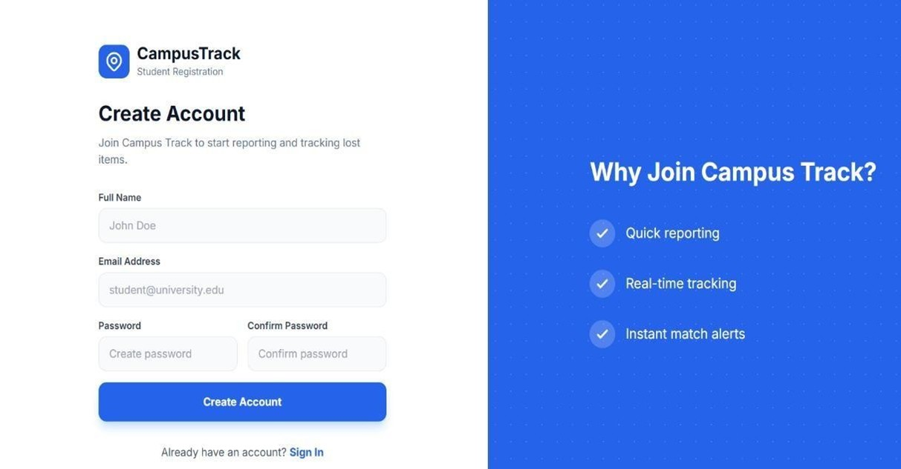
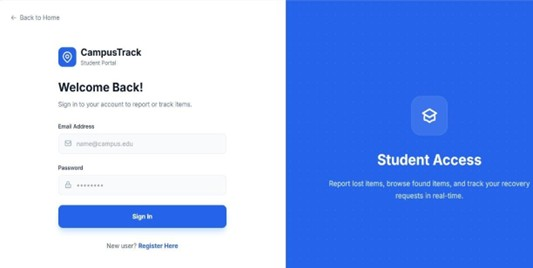
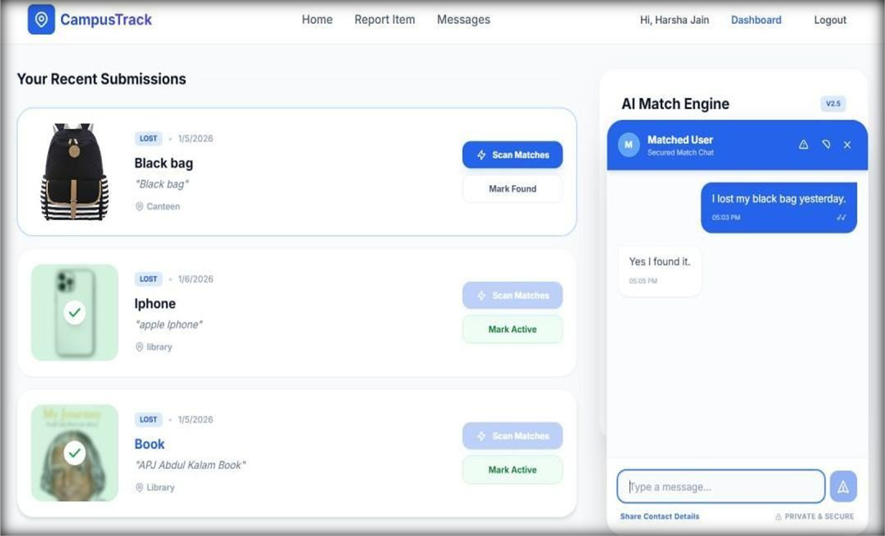

# CampusTrack - Lost and Found Portal

## Project Description
CampusTrack is a web-based Lost and Found Portal developed to help students and staff report, search, and recover lost items within a campus environment. The platform allows users to post lost or found items, communicate with others, and manage item records efficiently. The system aims to reduce manual effort and make the process of recovering belongings easier and faster.

## Technology Stack and Tools Used

### Frontend
- React.js
- TypeScript
- Vite
- HTML
- CSS

### Backend
- Node.js
- Express.js

### Database
- MongoDB

### Tools & Platforms
- VS Code
- Git
- GitHub

## Features and Functionalities Implemented

- User Registration and Login Authentication
- Report Lost Items
- Report Found Items
- Search and Browse Items
- AI search Engine
- Item Details Display
- Admin Dashboard
- Update/Delete Item Records
- Messaging/Communication Feature
- Responsive User Interface
  
## Installation / Execution Steps

### Step 1: Clone the repository
### Step 2: Navigate to project folder
### Step 3: Install frontend dependencies
### Step 4: Install backend dependencies
### Step 5: Configure environment variables
### Step 6: Start backend server
### Step 7: Start frontend`
### Step 8: Open application
## Team Members

1. Charu Sharma
2. Bhoomi Chouhan
3. Bhavishya Rathore
## Project Screenshots / Output

### Home Page

### Login Page

### Register Page

### User Dashboard

### Item Reporting Page

### Ai matching

### Messages Page

### Admin Dashboard

### Admin Dashboard
(Add screenshot here)
## Future Enhancements
- Email notifications
- Mobile application support
